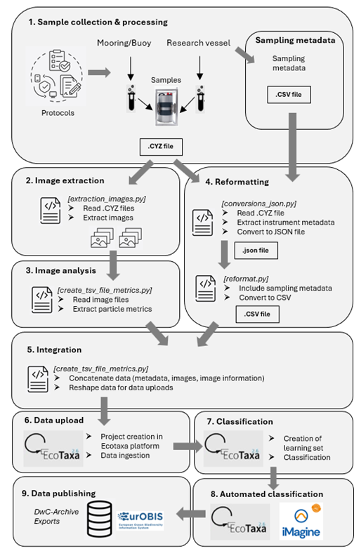

# Overview  

The workflow, as illustrated in **Figure 1**, starts with sample collection and processing (**#1**), where Cytosense generates .cyz files containing plankton images, fluorescence/scatter data, and instrument metadata. Next, image extraction (**#2**) is performed—this step uses a Python package to convert .cyz files into .JSON files and decode base64 images into .png images. During image analysis (**#3**), various morphological metrics (e.g., size, shape, texture) are computed to characterize each plankton particle.  

In the reformatting step (**#4**), relevant fields from the JSON file are gathered into .csv files that align with a predefined database schema. This is then combined with images and metrics in a single zipped package in the integration (**#5**) step. This package aligns with Ecotaxa, so it can be used for data upload (**#6**), where classification (**#7**) can occur. This classification may be performed manually—labeling images to create a training set—or through automated classification (**#8**) based on machine-learning models, with iterative improvements via manual corrections.  

Finally, the data publishing (**#9**) step involves exporting fully labeled images and metadata for open-access archiving (e.g., EMODnet Biology/EurOBIS), completing the end-to-end workflow from raw plankton samples to publicly shareable scientific data.  

**Figure 1**: Workflow of the flowcytometer pipeline.  
  

# Code Flow

## Input Code  
The Flow tarts with sample collection and processing (**#1**), where Cytosense generates .cyz files containing plankton images, fluorescence/scatter data, and instrument metadata
## step 1: Image extraction and reformatting (1)

The [cyz2json\cyz2json_python](cyz2json\cyz2json_python) folder of this repository contains code to process the output of the flowcytometer into an acceptable format. Two steps are required in this process:  
- [extraction_image.py](cyz2json/cyz2json_python/extraction_image.py): Convert .cyz file into .json file (**#2**)  
- [conversion_json.py](cyz2json/cyz2json_python/conversion_json.py): Extract the images (both cropped and not) (**#4**)  

These two steps can be run simultaneously by running the [automate_directories.py](cyz2json/cyz2json_python/automate_directories.py) script.

## step 2: Reformatting (2)

Then the data can be reformatted from json to .csv file by running the [reformat.py](json2csv/process_example/reformat.py) script within the [json2csv](json2csv) folder. (**#4**)

## step 3: Image analysis & integration  

The script [create_tsv_file_metrics.py](csv2ecotaxa/create_tsv_file_metrics.py) extracts various morphological and geometric properties from plankton images to characterize their shapes and structures. The metrics include parameters on size, area, shape, form, extent, solidity, orientation, bounding boxes, moments, textures, pixel counts, etc. (**#3**)

The previous script ([create_tsv_file_metrics.py](csv2ecotaxa/create_tsv_file_metrics.py)) also merges all the metadata (from sampling or added along the way) together in a .tsv file and zips it together with the images to match with an EcoTaxa upload (**#5**  & **#6**)

The script can be found in the [csv2ecotaxa](csv2ecotaxa) folder. 

## output Code
From this point the remaining steps from **Figure 1** can can be executed. 